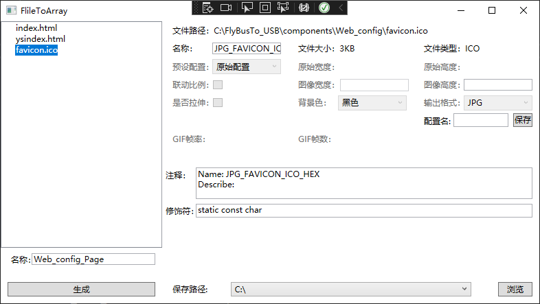
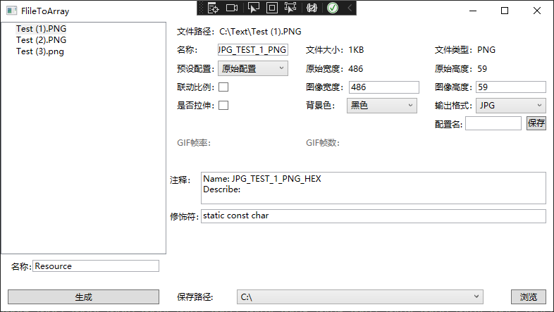

# TakeMold
## 说明
    该项目为一个由文件转换C语言数组的工具软件，目前可实现对Web文件(HTML|CSS|JS)，图片(JPEG|BMP|PNG),ICO图标文件，GIF动图文件。
## 示例
### WEB文件与ICO文件
    WEB文件直接通过文件流转换HEX数组的方式不提供代码压缩功能。

  

结果示例
```C
#ifndef RESOURCE_H
#define RESOURCE_H

#define FAVICON_ICO_Hex_Len 3475
// Name: FAVICON_ICO_HEX
// Describe:
static const char FAVICON_ICO_Hex[FAVICON_ICO_Hex_Len]={
0x00,0x00,0x01,0x00,0x01,0x00,0x00,0x00,0x00,0x00,0x01,0x00,
···
0x00,0x49,0x45,0x4E,0x44,0xAE,0x42,0x60,0x82};

#define INDEX_HTML_Hex_Len 10895
// Name: INDEX_HTML_HEX
// Describe:
static const char INDEX_HTML_Hex[INDEX_HTML_Hex_Len]={
0x3C,0x68,0x74,0x6D,0x6C,0x3E,0x0D,0x0A,0x3C,0x68,0x65,0x61,0x64,0x3E,0x0D,0x0A,0x20,0x20,
·····
0x6C,0x3E,0x0D,0x0A};

#endif
```
### 图片文件
    JPG\PNG\BMP文件可提供尺寸压缩，以及空白尺寸的填充或拉伸


结果示例
```C
#ifndef RESOURCE_H
#define RESOURCE_H

#define JPG_TEST_1_PNG_Hex_Len 6100
// Name: JPG_TEST_1_PNG_HEX
// Describe:
// Height:59px Width:486px
static const char JPG_TEST_1_PNG_Hex[JPG_TEST_1_PNG_Hex_Len]={
0xFF,0xD8,0xFF,0xE0,0x00,0x10,0x4A,0x46,0x49,
····
0xFF,0x00,0xC0,0x7F,0xFB,0x60,0xB1,0xFF,0xD9};

#endif
```
### GIF文件
    GIF文件可提供尺寸压缩，以及空白尺寸的填充或拉伸
    生成的代码包括GIF间隔时间 GIF帧数 GIF数组获取函数 GIF长度获取函数


结果示例
```C
#ifndef RESOURCE_H
#define RESOURCE_H

// AUTOIMAGE_GIF Frames
#define AUTOIMAGE_GIF_FrameN 11
// AUTOIMAGE_GIF Frame_Rate
#define AUTOIMAGE_GIF_Frame_Rate 130
// AUTOIMAGE_GIF GetImageBit
char * Get_AUTOIMAGE_GIF(char i)
{
    switch (i)
    {
        case 0:
            return AUTOIMAGE_GIF_0_Hex;
····
        case 10:
            return AUTOIMAGE_GIF_10_Hex;
    }
};
// AUTOIMAGE_GIF GetImageLen
int Get_AUTOIMAGE_GIF_Len(char i)
{
    switch (i)
    {
        case 0:
            return AUTOIMAGE_GIF_0_Hex_Len;
        case 10:
            return AUTOIMAGE_GIF_10_Hex_Len;
    }
};
#define AUTOIMAGE_GIF_0_Hex_Len 4124
// AUTOIMAGE_GIF_0
// Name: AUTOIMAGE_GIF_HEX
// Describe:
// Height:134px Width:200px
static const char AUTOIMAGE_GIF_0_Hex[AUTOIMAGE_GIF_0_Hex_Len]={
0xFF,0xD8,0xFF,0xE0,0x00,0x10,0x4A,0x46,0x49,0x46,0x00,0x01,0x01,0x01
······
0xEE,0xD4,0x51,0x45,0x31,0x1F,0xFF,0xD9};

#endif
```
